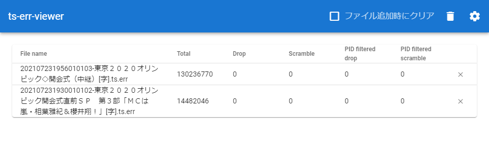

# ts-err-viewer
DTV 録画ソフトより出力された MPEG2-TS のログを簡易的に表示するビューワ



## 対応ファイル
* EDCB (*.ts.err)
* Multi2Dec (*_dec.txt)

## Project setup
```
yarn install
```

### Compiles and hot-reloads for development
```
yarn serve
```
and drag-and-drop error log file to the browser window.

### Compiles and minifies for production
```
yarn build
```

### Lints and fixes files
```
yarn lint
```

### Customize configuration
See [Configuration Reference](https://cli.vuejs.org/config/).
